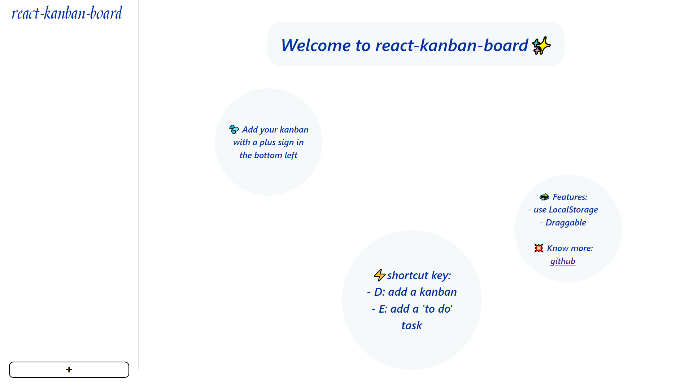
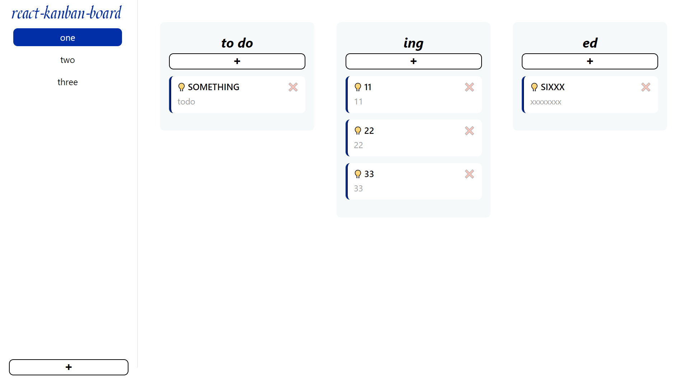
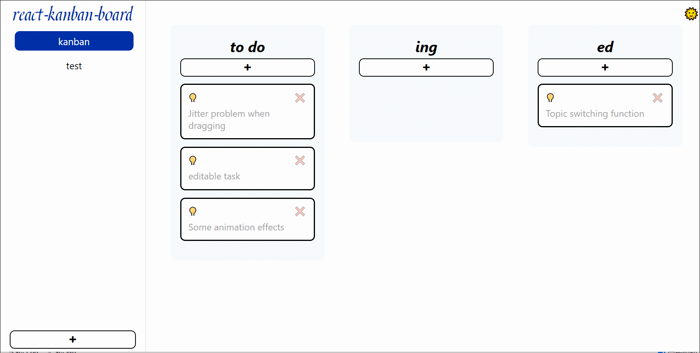

# React-kanban-board

A kanban App






## Features

- draggable
- All data is stored locally
- shortcut key
- light

## Tech stack & dependencies

- React
- [Create React App](https://github.com/facebook/create-react-app).
- TypeScript
- react-beautiful-dnd
- nanoid

## Development

### setup

```
git clone git@github.com:okkjoo/react-kanban-board.git
or
git clone https://github.com/okkjoo/react-kanban-board.git

cd react-kanban-board

yarn
```

### `yarn start`

Open [http://localhost:3000](http://localhost:3000) to view it in the browser.

### TODO

- [ ] Jitter problem when dragging
- [ ] editable task
- [ ] Some animation effects
- [x] Topic switching function
